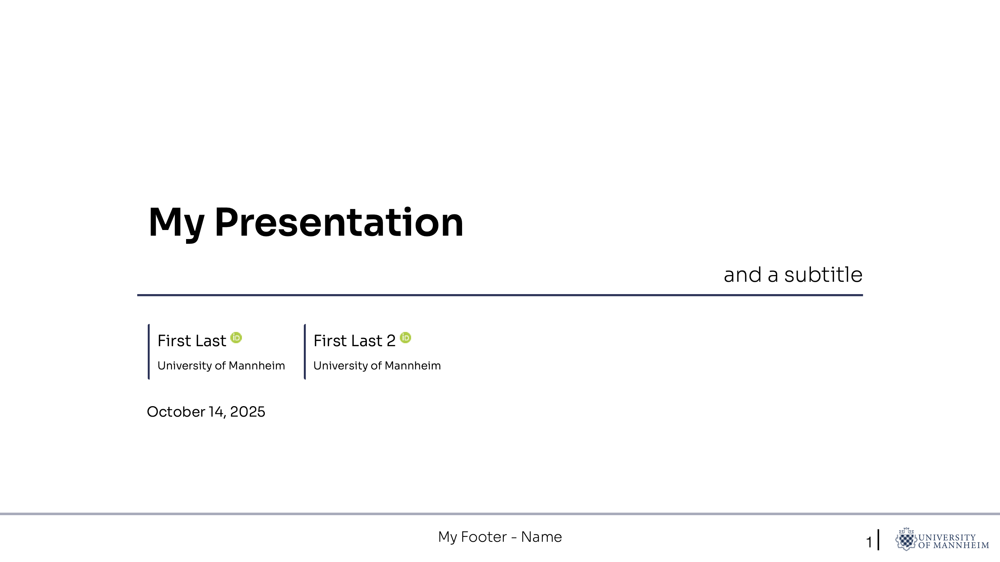
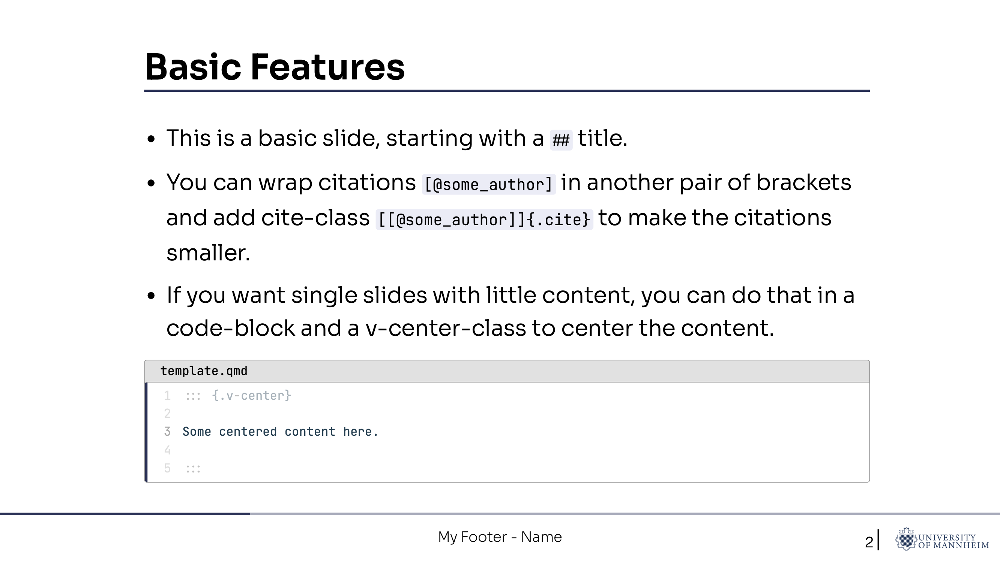

# Quarto Template for UniMa

This is a quarto template to use for people from the University of Mannheim.
It is inspired by [quarto-metropolis](https://codeberg.org/pat-s/quarto-metropolis/src/branch/main) and [mzes-beamer-metropolis](https://github.com/denis-cohen/mzes-beamer-metropolis).
Feel free to check them out and edit/fork the theme as you like.
This is work in progress.

## Installing

Go to the folder you want to have your presentation in and execute this command.

```bash

quarto use template frodew/quarto_theme_unima

```

This will install the extension and create `template.qmd` that you can use as a starting place for your presentation.

## Format Options

I applied some basic formatting in the `unima.scss` file.
The basic functionality is spelled out in the `template.qmd`.
This template comes with locally available fonts `Sora` as the default sans-serif and `JetBrains Mono` as for monospace.

## Print as PDF

You can print the HTML slides as a PDF with `decktape`, as described [here](https://gongcastro.github.io/blog/revaljs-to-pdf/revealjs-to-pdf.html).

```bash

decktape reveal <url of your quarto preview, e.g., `"http://localhost:42"`> <name of the desired pdf, e.g., `presentation.pdf`>

```

If you want to export each animation/fragment-step as an extra slide you can include `--fragments=true` in your export command.
To export your progress bar, add `--progress=true`.

If you want to export your notes, you can do that by adding `?showNotes=true` to your URL, for example `"http://localhost:42?showNotes=true"`.

I like to use that default to export my pdf-presentation and my notes:

```bash

decktape reveal "http://localhost:42" --fragments=true --progress=true presentation.pdf

decktape reveal "http://localhost:42?showNotes=true" presentation_notes.pdf

```

## Example

You can find an exported example PDF in this repo: `template.pdf`.

The first two pages looks like this:




